# LLM Security: A Practical Open-Source Guide

English | [简体中文](README_ZH.md)

Large language model security is no longer limited to harmful text generation. Once an application adds retrieval, memory, tools, code execution, or autonomous planning, a model mistake can become data exposure, an unauthorized action, or a production incident.

This project organizes LLM-native security into six areas:

1. Input security
2. Context security
3. Model security
4. Agent security
5. Tool security
6. Output security

Each area is discussed from three angles: the threats teams face, the practical gaps that make those threats difficult to manage, and open-source projects worth evaluating.

> **Scope note:** This guide focuses on risks specific to LLM applications and AI agents. Traditional perimeter security and security operations are intentionally out of scope. Authentication, host hardening, network segmentation, vulnerability management, logging, incident response, and other established controls are still required.

Open-source project status was checked on August 28, 2026. A recommendation means that a project fits a particular control point; it does not mean that deploying the project creates a complete security boundary.

## Security flow

```mermaid
flowchart LR
    INPUT["① INPUT SECURITY<br/>Normalize · Detect · Downgrade<br/>Purple Llama · NeMo"]
    CONTEXT["② CONTEXT SECURITY<br/>Authorize · Isolate · Preserve provenance<br/>pgvector · OPA"]
    MODEL["③ MODEL SECURITY<br/>Verify · Scan · Audit<br/>Safetensors · garak · Inspect Petri"]
    AGENT["④ AGENT SECURITY<br/>Constrain · Observe · Evaluate<br/>ADR · AgentDojo · gVisor"]
    TOOL["⑤ TOOL SECURITY<br/>Authorize · Validate · Isolate<br/>Higress · OPA · Firecracker"]
    OUTPUT["⑥ OUTPUT SECURITY<br/>Moderate · Redact · Sanitize<br/>Llama Guard · Presidio · DOMPurify"]

    INPUT -->|Trusted input| CONTEXT
    CONTEXT -->|Authorized context| MODEL
    MODEL -->|Evaluated decision| AGENT
    AGENT -->|Policy-approved action| TOOL
    TOOL -->|Verified result| OUTPUT
```

## 1. Input Security

### Threats

- Direct prompt injection and jailbreak attempts
- Indirect instructions hidden in files, websites, email, OCR, or transcribed audio
- Unicode obfuscation, multilingual rewriting, and long-context evasion
- Oversized or adversarial multimodal inputs

### Industry gaps

LLMs do not provide a hard separation between instructions and data. XML tags, prompt delimiters, and stronger system prompts can improve behavior, but they do not create an authorization boundary. Regular expressions are inexpensive but easy to evade; classifiers add semantic coverage but also introduce false positives, latency, and another model that can be attacked.

### Open-source recommendations

- [Purple Llama](https://github.com/meta-llama/PurpleLlama): use Prompt Guard for prompt-injection and jailbreak classification, and Llama Guard for harmful-content categories. Do not treat the two models as interchangeable.
- [NeMo Guardrails](https://github.com/NVIDIA-NeMo/Guardrails): useful for programmable input, dialogue, retrieval, and output checks in applications with a clear task boundary.
- [LLM Guard](https://github.com/protectai/llm-guard): the repository was archived in July 2026. Existing deployments can pin and maintain a reviewed version, but new projects should not make it a primary dependency.

Recommended approach: normalize and limit inputs first, run inexpensive rules second, send suspicious cases to a dedicated classifier, and translate the result into an action such as reject, review, read-only mode, or permission reduction. A risk label that does not change privileges has little defensive value.

## 2. Context Security

### Threats

- RAG poisoning and retrieval-ranking manipulation
- Cross-tenant data exposure
- Long-term memory poisoning
- Instructions embedded in tool results or external documents
- Loss of provenance during summarization and context compression

### Industry gaps

Vector similarity answers which content is close to a query; it does not answer whether the caller is authorized to read it. Many RAG systems keep text and embeddings but omit the source, tenant, owner, trust level, version, and ingestion time. Once untrusted content is summarized without those attributes, the application can no longer distinguish a verified fact from an external claim.

### Open-source recommendations

- [pgvector](https://github.com/pgvector/pgvector) with PostgreSQL Row-Level Security: a practical choice when retrieval authorization must be enforced before content enters the model context.
- [Open Policy Agent](https://github.com/open-policy-agent/opa): suitable for policies that decide who may retrieve a document, which sources may enter a sensitive task, and when content may be written to long-term memory.

Every context item should retain structured metadata such as `source`, `tenant_id`, `owner_id`, `trust_level`, `content_hash`, and `ingested_at`. Apply authorization before vector search or as a server-enforced filter, preserve provenance after retrieval, and keep secrets out of system prompts entirely.

## 3. Model Security

### Threats

- Training-data poisoning and behavioral backdoors
- Alignment degradation after fine-tuning or LoRA adaptation
- Malicious model artifacts and unsafe deserialization
- Model extraction, jailbreak regressions, and version drift

### Industry gaps

Rare trigger-based backdoors are difficult to detect with normal accuracy tests. Model updates can improve task quality while changing refusal behavior or tool-use patterns. Artifact scanners can find known unsafe formats, but they cannot prove that a model is free of behavioral backdoors.

### Open-source recommendations

- [Safetensors](https://github.com/safetensors/safetensors): prefer tensor-only artifacts over Pickle-based formats. Reject `trust_remote_code` by default and isolate any approved exception.
- [Cosign](https://github.com/sigstore/cosign): sign and verify model artifacts, hashes, and release provenance.
- [ModelScan](https://github.com/protectai/modelscan) or [ModelAudit](https://github.com/promptfoo/modelaudit): use for static artifact inspection inside an isolated environment.
- [garak](https://github.com/NVIDIA/garak): useful for broad vulnerability probing before release.
- [Inspect Petri](https://github.com/meridianlabs-ai/inspect_petri): recommended for deeper, multi-turn behavioral audits. It can generate audit scenarios, coordinate an auditor and target model, simulate tools and rollbacks, and score transcripts against a consistent rubric.
- [Promptfoo](https://github.com/promptfoo/promptfoo): maintain private security regressions tied to the application's actual tasks and previous failures.

A practical evaluation flow is broad probing with garak, hypothesis-driven audits with Inspect Petri, and durable regression tests in Promptfoo. Inspect Petri depends on auditor and judge models, so its findings still require calibration and human review; it is not a runtime firewall.

## 4. Agent Security

Agents introduce planning, memory, delegation, and long-running control flow. Their security depends heavily on whether the agent is built in-house or adopted as an existing product.

### Threats

- Over-autonomy that turns one bad decision into a chain of actions
- Control-flow hijacking through web pages, email, code comments, or shared memory
- Privilege escalation across multiple agents
- Approval fatigue and unclear confirmation screens
- Runtime-generated behavior that is difficult to review before execution

### Self-built agents

Keep authorization outside the model. The model may propose a plan or action, but deterministic code must decide whether it can run.

- Use [Open Policy Agent](https://github.com/open-policy-agent/opa) for policy decisions based on the original user, task, resource, and risk level.
- Issue task-scoped, audience-bound, short-lived credentials. Do not expose long-lived secrets to the model.
- Apply the Rule of Two: one agent should not simultaneously process untrusted input, access sensitive data, and change state or communicate externally.
- Isolate code, browsers, and third-party components with [gVisor](https://github.com/google/gvisor), [Firecracker](https://github.com/firecracker-microvm/firecracker), or an equivalent boundary.
- Use [AgentDojo](https://github.com/ethz-spylab/agentdojo) for regression testing of task success and indirect prompt-injection resistance. It is a benchmark, not a runtime control.

### Existing agents

For products such as coding agents, desktop agents, and browser agents, the customer usually cannot change the internal orchestrator. Security must be built around accounts, workspaces, tools, network access, and telemetry.

- [Uber ADR](https://github.com/uber/ADR) is the primary recommendation for discovery and detection. Its open-source components inventory AI tools and MCP servers, collect normalized agent telemetry, provide ADR-Bench, and detect suspicious sessions. The current open-source release does not include ADR Prevention or the offline ADR Explorer.
- [Snyk Agent Scan](https://github.com/snyk/agent-scan) is useful for reviewing MCP, skills, and agent configuration before adoption. Treat unknown stdio configurations as untrusted because scanning can start their configured commands.
- [Falco](https://github.com/falcosecurity/falco) can detect suspicious process, file, and network behavior at runtime, but it does not block or isolate the workload by itself.

Use dedicated low-privilege accounts, isolated browser profiles, narrowly mounted workspaces, short-lived credentials, and outbound network allowlists. If an existing agent cannot constrain its tools, files, network, and credentials—or cannot produce adequate evidence of its actions—it should not handle irreversible operations or production secrets.

## 5. Tool Security

### Threats

- Parameter injection into shells, SQL, file paths, email, or payment APIs
- Tool-description poisoning, Rug Pull, and Tool Shadowing
- Confused-deputy behavior caused by broad or forwarded tokens
- Tool results that inject new instructions into the agent

### Industry gaps

A valid JSON payload is not necessarily an authorized action. Schema validation checks shape, not ownership, business intent, or the original user's permission. Tool combinations also matter: browsing the web, reading private data, and sending messages may each look reasonable in isolation while forming a complete exfiltration path together.

### Open-source recommendations

- [Higress](https://github.com/higress-group/higress) is the primary tool-gateway recommendation. It can manage LLM and MCP APIs through one gateway and provide authentication, authorization, fine-grained rate limiting, audit logs, and observability for MCP servers.
- [Open Policy Agent](https://github.com/open-policy-agent/opa) complements the gateway with resource- and task-aware policy decisions.
- JSON Schema, Pydantic, or an equivalent type system should restrict parameters before execution.

Place Higress between agents and tool services, not only in front of model APIs. Separate identities and routes by agent, tenant, and task; expose only required tools; pin tool descriptions and schemas; and require review when they change. Use short-lived credentials and revalidate the target resource at the execution layer. A gateway does not replace gVisor, Firecracker, or a virtual machine when untrusted code must run.

## 6. Output Security

### Threats

- Harmful content, PII, secrets, or internal instructions in model output
- Unsafe code and fabricated facts
- XSS, SQL injection, or command injection when output reaches another interpreter
- Data exfiltration through automatically loaded Markdown images or external URLs

### Industry gaps

Output risk depends on its destination. The same string has different consequences when shown to a person, rendered as HTML, parsed as JSON, inserted into SQL, or passed to a shell. Streaming makes post-generation moderation harder because content may reach the client before the complete response can be evaluated.

### Open-source recommendations

- Llama Guard from [Purple Llama](https://github.com/meta-llama/PurpleLlama): classify harmful input and output categories.
- [Microsoft Presidio](https://github.com/microsoft/presidio): detect and redact PII, supplemented with organization-specific identifiers and secret patterns.
- [Guardrails AI](https://github.com/guardrails-ai/guardrails), JSON Schema, or Pydantic: validate typed output for programmatic consumers.
- [DOMPurify](https://github.com/cure53/DOMPurify): sanitize HTML together with a restrictive Content Security Policy and separate URL controls.

Never pass model-generated free text directly to a shell, SQL engine, template engine, or dangerous browser sink. Parse it into a constrained structure, validate the structure and resource ownership, and let deterministic application code decide what happens next.

## Project principles

- Assume prompt injection will occasionally bypass detection.
- Make detection results change permissions or execution paths.
- Keep identities, authorization, secrets, and irreversible decisions outside the model.
- Treat retrieved content, memory, tool descriptions, and tool results as untrusted inputs.
- Evaluate both security and task completion; a system that rejects everything is not useful.
- Record project versions and known limitations so recommendations remain reviewable.

## References

- [OWASP Top 10 for LLM Applications](https://genai.owasp.org/llm-top-10/)
- [OWASP Top 10 for Agentic Applications](https://genai.owasp.org/resource/owasp-top-10-for-agentic-applications-for-2026/)
- Official repositories and documentation linked in each section
