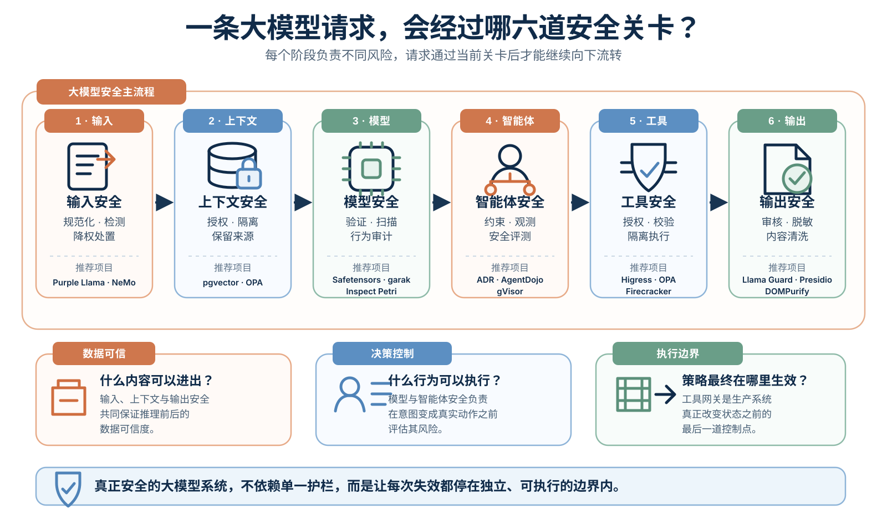

# 大模型安全：开源落地指南

[English](README.md) | 简体中文

大模型安全早已不只是“会不会生成有害内容”。应用一旦加入检索、长期记忆、工具调用、代码执行或自主规划，模型的一次误判就可能变成数据泄露、越权操作，甚至直接影响生产系统。

本项目聚焦六个大模型原生安全方向：

1. 输入安全
2. 上下文安全
3. 模型安全
4. 智能体安全
5. 工具安全
6. 输出安全

每个方向都从面临的威胁、行业难点和开源方案三个角度展开。

> **范围说明：** 本项目只讨论大模型应用和智能体特有的安全问题，不展开传统边界安全与安全运营。身份认证、主机加固、网络隔离、漏洞管理、日志审计和事件响应等成熟控制仍然是必要基础。

文中的开源项目状态核对日期为 2026 年 8 月 28 日。“推荐”只表示项目适合某个控制点，不代表部署一个项目就能形成完整的安全边界。

## 安全流程

## 一、输入安全

### 面临的威胁

- 直接提示注入与越狱
- 藏在文档、网页、邮件、OCR 或音频转写中的间接指令
- Unicode 混淆、多语言改写和长上下文绕过
- 超大或带有对抗内容的多模态输入

### 行业难点

大模型没有稳定的“指令/数据”硬隔离。XML 标签、分隔符和更强硬的系统提示可以改善行为，却不能形成授权边界。正则规则便宜，但容易被字符变体和语义改写绕过；分类器覆盖面更广，同时也会引入误报、延迟和新的模型攻击面。

### 开源方案与推荐

- [Purple Llama](https://github.com/meta-llama/PurpleLlama)：Prompt Guard 适合做提示注入和越狱分类，Llama Guard 适合判断输入输出是否属于特定有害类别，两者不应混为一用。
- [NeMo Guardrails](https://github.com/NVIDIA-NeMo/Guardrails)：适合为任务边界清晰的应用编排输入、对话、检索和输出检查。
- [LLM Guard](https://github.com/protectai/llm-guard)：该仓库已于 2026 年 7 月归档。已有系统可以固定并维护审查过的版本，新项目不宜再把它作为核心依赖。

建议先做输入规范化和大小限制，再运行低成本规则，把可疑请求送入专用分类器，最后根据结果执行拒绝、人工复核、只读运行或权限降级。检测结果如果不改变权限或执行路径，防护价值十分有限。

## 二、上下文安全

### 面临的威胁

- RAG 知识库投毒与检索排序操纵
- 跨租户数据泄露
- 长期记忆污染
- 工具返回值或外部文档中的隐藏指令
- 摘要与上下文压缩造成的来源丢失

### 行业难点

向量相似度只能回答“哪段内容与查询更接近”，不能回答“调用者是否有权查看”。许多 RAG 系统只保存文本和向量，没有保存来源、租户、所有者、可信度、版本和入库时间。外部内容一旦在缺少这些属性的情况下被压缩成摘要，应用就很难再区分可信事实与未经验证的说法。

### 开源方案与推荐

- [pgvector](https://github.com/pgvector/pgvector)配合 PostgreSQL 行级安全策略：适合在内容进入模型上下文前强制执行检索授权。
- [Open Policy Agent](https://github.com/open-policy-agent/opa)：适合定义谁能检索哪些文档、哪些来源能进入敏感任务，以及什么内容可以写入长期记忆。

每个上下文片段至少应保留 `source`、`tenant_id`、`owner_id`、`trust_level`、`content_hash` 和 `ingested_at`。授权要发生在检索之前，或由服务端强制附加过滤条件；检索完成后仍要保留来源信息。密钥等真正敏感的内容不要放进系统提示。

## 三、模型安全

### 面临的威胁

- 训练数据投毒与行为后门
- 微调或 LoRA 适配造成的对齐能力退化
- 恶意模型工件与危险反序列化
- 模型提取、越狱回归和版本漂移

### 行业难点

只在罕见触发条件下出现的后门，很难通过常规准确率测试发现。模型升级可能改善业务效果，同时改变拒答或工具调用行为。工件扫描器能够识别已覆盖的危险格式，却无法证明模型不存在行为后门。

### 开源方案与推荐

- [Safetensors](https://github.com/safetensors/safetensors)：优先采用只保存张量的格式，默认拒绝 Pickle 类工件和 `trust_remote_code`，确有例外时必须隔离加载。
- [Cosign](https://github.com/sigstore/cosign)：用于签名并验证模型工件、哈希与发布来源。
- [ModelScan](https://github.com/protectai/modelscan)或 [ModelAudit](https://github.com/promptfoo/modelaudit)：用于隔离环境中的模型工件静态检查。
- [garak](https://github.com/NVIDIA/garak)：适合在发布前做广覆盖漏洞探测。
- [Inspect Petri](https://github.com/meridianlabs-ai/inspect_petri)：推荐用于更深入的多轮行为审计。它可以生成审计场景，协调审计模型与目标模型，模拟工具和回滚，并按统一量表评估对话。
- [Promptfoo](https://github.com/promptfoo/promptfoo)：用于维护与实际业务和历史缺陷相关的私有安全回归集。

建议先用 garak 扫描较宽的攻击面，再用 Inspect Petri 验证具体风险假设，最后把已发现问题沉淀到 Promptfoo 回归集。Inspect Petri 的结果会受到审计模型、裁判模型和评分量表影响，仍需校准与人工复核，也不能替代线上防火墙。

## 四、智能体安全

智能体增加了规划、记忆、任务转交和长时间运行的控制流。安全方案必须区分自建智能体和无法修改内部编排器的现有智能体。

### 面临的威胁

- 过度自治把一次误判放大成连续动作
- 网页、邮件、代码注释或共享记忆劫持控制流
- 多智能体之间的信任传递与权限提升
- 审批疲劳和信息不清晰的确认界面
- 运行时生成的行为难以上线前完整审查

### 自建智能体

授权必须留在模型之外。模型可以提出计划和动作，但能否执行要由确定性程序判断。

- 使用 [Open Policy Agent](https://github.com/open-policy-agent/opa)，根据原始用户、任务、资源和风险等级做策略判定。
- 按任务签发受众明确、有效期短的凭据，不向模型暴露长期密钥。
- 采用 Rule of Two：单个智能体不应同时处理不可信输入、访问敏感数据并改变状态或对外通信。
- 用 [gVisor](https://github.com/google/gvisor)、[Firecracker](https://github.com/firecracker-microvm/firecracker)或同等级边界隔离代码、浏览器和第三方组件。
- 用 [AgentDojo](https://github.com/ethz-spylab/agentdojo)回归测试任务完成率和间接提示注入抵抗能力。它是评测环境，不是运行时防火墙。

### 现有智能体

对于代码智能体、桌面智能体和浏览器智能体，使用方通常无法修改内部编排逻辑，只能从账号、工作区、工具、网络和遥测入手。

- [Uber ADR](https://github.com/uber/ADR)是现有智能体发现与检测的主要推荐。其开源部分可以盘点 AI 工具与 MCP Server、采集统一格式的智能体遥测、运行 ADR-Bench，并检测可疑会话。当前开源版本不包含 ADR Prevention 和离线 ADR Explorer。
- [Snyk Agent Scan](https://github.com/snyk/agent-scan)适合在接入前审查 MCP、技能和智能体配置。陌生的 stdio 配置必须视为不可信，因为扫描过程可能启动其中配置的命令。
- [Falco](https://github.com/falcosecurity/falco)可以发现异常进程、文件和网络行为，但它本身不负责阻断或隔离。

现有智能体应使用独立低权限账号、隔离的浏览器配置、最小挂载工作区、短期凭据和出站网络白名单。如果一个产品无法约束工具、文件、网络和凭据，也无法提供足够的行为证据，就不应让它处理不可逆操作或生产密钥。

## 五、工具安全

### 面临的威胁

- Shell、SQL、文件路径、邮件或支付接口的参数注入
- 工具描述投毒、Rug Pull 和 Tool Shadowing
- 宽泛或透传 Token 引发的混淆代理问题
- 工具返回值向智能体注入新的恶意指令

### 行业难点

合法 JSON 不等于合法动作。Schema 只能检查结构，不能确认资源归属、业务意图和原始用户权限。工具组合也会放大风险：浏览网页、读取私有数据和发送消息单独看都很普通，组合在一起却能形成完整的数据外泄链。

### 开源方案与推荐

- [Higress](https://github.com/higress-group/higress)是工具网关的主要推荐。它可以统一管理 LLM API 与 MCP API，并为 MCP Server 提供认证授权、细粒度限流、调用审计和可观测能力。
- [Open Policy Agent](https://github.com/open-policy-agent/opa)用于补充与资源、任务和原始用户相关的策略判断。
- JSON Schema、Pydantic 或等价类型系统负责在执行前收紧参数范围。

Higress 应部署在智能体与工具服务之间，而不只是放在模型 API 前面。按照智能体、租户和任务拆分身份与路由，只开放必要工具；固定工具描述与 schema 的版本和哈希，发生变化时重新审查。工具使用短期凭据，执行层再次验证目标资源。需要运行不可信代码时，工具网关不能替代 gVisor、Firecracker 或虚拟机。

## 六、输出安全

### 面临的威胁

- 模型输出有害内容、PII、密钥或内部指令
- 不安全代码和错误事实
- 输出进入其他解释器后触发 XSS、SQL 注入或命令注入
- 自动加载 Markdown 图片或外部 URL 造成的数据外带

### 行业难点

输出风险取决于目的地。同一段字符串显示给人、渲染成 HTML、解析为 JSON、拼入 SQL 或传给 Shell，会产生完全不同的后果。流式输出也会削弱后置审核，因为完整响应尚未生成时，一部分内容可能已经到达客户端。

### 开源方案与推荐

- [Purple Llama](https://github.com/meta-llama/PurpleLlama)中的 Llama Guard：用于判断输入输出是否属于特定有害类别。
- [Microsoft Presidio](https://github.com/microsoft/presidio)：用于 PII 检测与脱敏，并补充组织自己的账号、业务标识和密钥规则。
- [Guardrails AI](https://github.com/guardrails-ai/guardrails)、JSON Schema 或 Pydantic：用于校验提供给程序消费的结构化输出。
- [DOMPurify](https://github.com/cure53/DOMPurify)：配合严格的 CSP 和独立 URL 控制清洗 HTML。

模型生成的自由文本不能直接进入 Shell、SQL、模板引擎或浏览器危险 sink。先解析成受限结构，再校验字段、资源归属和权限，最后由确定性业务代码决定如何执行。

## 项目原则

- 假设提示注入偶尔会绕过检测。
- 让检测结果真正改变权限或执行路径。
- 身份、授权、密钥和不可逆决策必须留在模型之外。
- 将检索内容、记忆、工具描述和工具返回值都视为不可信输入。
- 同时评估安全性与任务完成率；拒绝一切的系统没有实际价值。
- 记录项目版本与已知限制，让推荐意见可以持续复查。

## 参考资料

- [OWASP Top 10 for LLM Applications](https://genai.owasp.org/llm-top-10/)
- [OWASP Top 10 for Agentic Applications](https://genai.owasp.org/resource/owasp-top-10-for-agentic-applications-for-2026/)
- 各章节链接的开源项目官方仓库与文档
